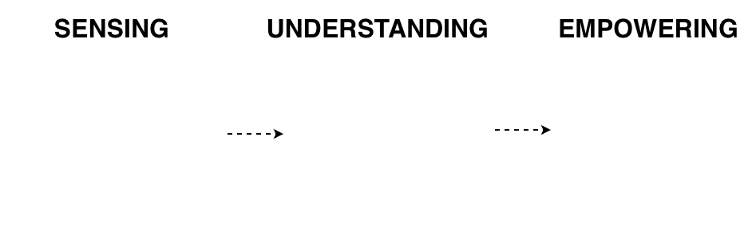

**Dr.-Ing. Zhao Ren** is a *Senior Researcher* at the <a href="https://www.uni-bremen.de/csl" target="_blank">Cognitive Systems Lab</a>, <a href="https://www.uni-bremen.de" target="_blank">University of Bremen</a>, Germany. Before this, she received her doctoral degree from <a href="https://www.uni-augsburg.de/en/" target="_blank">University of Augsburg</a>, Germany, in 2022, and worked as a Research Associate in <a href="https://www.l3s.de/en" target="_blank">L3S Research Center</a>, <a href="https://www.uni-hannover.de/en/" target="_blank">Leibniz University Hannover</a>, Germany. 

Her research interests mainly lie in affective computing, computational paralinguistics, silent paralinguistics, and digital health. She has (co-)authored 70+ publications in peer-reviewed book chapters, journals, and conference proceedings, which have received 3k+ citations (h-index 27). She serves as a Guest Editor in IEEE JBHI, Cyborg and Bionic Systems, and multiple Frontiers journals. She is an Associate Editor of Frontiers in Digital Health, and chaired sessions in ICASSP and EMBC. 

# Research Topics

## Listening (Advanced Sensing & Health Monitoring)
* *Physiological Health*: Using advanced signal processing to decode sounds from the cardiovascular and pulmonary systems for early diagnostic screening.
* *Mental and Cognitive Health*: Analyzing speech to assess emotional states, cognitive disorders, and physiological markers of health, as well as hate speech.
* *Intelligent Systems*: Acoustic monitoring for industrial safety and robust environmental sensing.

## Understanding (Trustworthiness)
* *Transparent Decision-Making*: Moving from "black-box" models to explainable AI that provides clear reasoning for its predictions.
* *Reliability*: Ensuring that AI systems remain robust against interference and consistent across different users and environments.
* *Privacy*: Pioneering methodologies that protect sensitive medical data and respect individual privacy rights in digital health interactions.

## Empowering (Human Communication)
* *Silent Speech Interfaces*: Developing alternative communication channels that translate silent muscle signals into high-quality, intelligible speech.
* *Natural Human Expression*: Synthesizing voices that are not just accurate, but also carry the natural paralinguistic and emotional richness of human speech.

---

### My Philosophy

Life is not always smooth sailing. Our greatness lies not in never falling, but in loving the mountain we choose to climb.
> 
> "Meine Formel für die Größe am Menschen ist amor fati: dass man Nichts anders haben will, vorwärts nicht, rückwärts nicht, in alle Ewigkeit nicht. Das Nothwendige nicht bloss ertragen, noch weniger verhehlen - aller Idealismus ist Verlogenheit vor dem Nothwendigen -, sondern es lieben."
> 
> English Translation: My formula for greatness in a human being is amor fati: that one wants nothing to be different, not forward, not backward, not in all eternity. Not merely bear what is necessary, still less conceal it - all idealism is mendaciousness in the face of what is necessary - but love it.
> 
--- Friedrich Nietzsche, Ecce homo: Wie man wird, was man ist, §10
