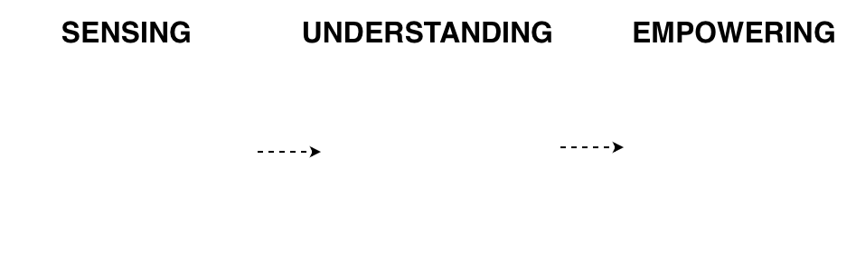

**Dr.-Ing. Zhao Ren** is a *Senior Researcher* at the <a href="https://www.uni-bremen.de/csl" target="_blank">Cognitive Systems Lab</a>, <a href="https://www.uni-bremen.de" target="_blank">University of Bremen</a>, Germany. Before this, she received her doctoral degree from <a href="https://www.uni-augsburg.de/en/" target="_blank">University of Augsburg</a>, Germany, in 2022, and worked as a Research Associate in <a href="https://www.l3s.de/en" target="_blank">L3S Research Center</a>, <a href="https://www.uni-hannover.de/en/" target="_blank">Leibniz University Hannover</a>, Germany. 

Her research interests mainly lie in affective computing, computational paralinguistics, silent paralinguistics, and digital health. She has (co-)authored 80+ publications in peer-reviewed book chapters, journals, and conference proceedings, which have received 3.5k+ citations (h-index 31). She serves as a Guest Editor in IEEE JBHI, Cyborg and Bionic Systems, and multiple Frontiers journals. She is an Associate Editor of Frontiers in Digital Health, and a Session Chair in ICASSP and EMBC. 

# Highlights
* 06/2026: Two papers (1 long paper + 1 short paper) accepted at INTERSPEECH 2026.
* 05/2026: I am invited as Publicity Chair at the <a href="https://adc-conference.github.io/2026/" target="_blank">Australasian Database Conference (ADC) 2026</a>.
* 05/2026: Nominated and Selected for the **IJCAI 2026 Early Career Spotlight**! I will be giving an invited talk in IJCAI at Bremen, Germany (August 15–21, 2026). This honor recognizes highly promising researchers in the AI community.
* 03/2026: **Best Presentation Award**, Free Rein · Global Youth AI Forum (CUHK-SZ). Selected from ~100 invited young scholars from top-tier global institutions for excellence in research communication.
* 2026: **Multimodal Hate Speech Detection**. New research accepted at LREC 2026.
* 2025: **High-Impact Journal Publications in AI Safety and Health**. New papers in IEEE Transactions on Affective Computing (TAFFC) on sparse adversarial attacks (STAA-Net), IEEE/ACM TASLP on depression detection, and ACM TIST on machine unlearning.
* 2025: **INTERSPEECH & EMBC**. Contributions to Silent Speech Interfaces and Emotion Recognition accepted at leading speech and bio-engineering venues.
* 2024: **State-of-the-Art Survey**. My comprehensive review of Heart Sound Analysis was published in IEEE Computational Intelligence Magazine.
* 2023–2024: Continued publications in leading AI venues including ICASSP, IJCNN, and EUSIPCO.

# Professional Activities (Ongoing)
* Workshop: <a href="https://ei-miga.github.io" target="_blank">EI-MiGA: The First Joint Workshop on Human Behavior Analysis and Interaction for Emotional Intelligence, with the 4th MiGA Challenge</a>, IJCAI-ECAI, Bremen, Germany, 2026
* Special Issue: <a href="https://www.frontiersin.org/research-topics/73731/advancing-personalized-healthcare-through-ai-and-computer-audition-technologies" target="_blank">Advancing Personalized Healthcare Through AI and Computer Audition Technologies</a>, Frontiers in Computer Science, Frontiers in Artificial Intelligence, Frontiers in Big Data, Frontiers in Digital Health, Frontiers in Psychiatry
* Special Issue: <a href="https://spj.science.org/page/cbsystems/si/audio-inspired-methods-for-healthcare" target="_blank">Audio-Inspired Methods for Healthcare</a>, Cyborg and Bionic Systems

# Research Topics

## Sensing (Health Monitoring)
* *Mental and Cognitive Health*: Analyzing speech to assess emotional states, cognitive disorders, and physiological markers of health, as well as hate speech.
* *Physiological Health*: Using advanced signal processing to decode sounds from the cardiovascular and pulmonary systems for early diagnostic screening.
* *Intelligent Systems*: Acoustic monitoring for industrial safety and robust environmental sensing.

## Understanding (Trustworthiness)
* *Reliability*: Ensuring that emotional AI systems remain robust against interference and consistent across different users and environments.
* *Privacy*: Pioneering methodologies that protect sensitive emotional speech data and respect individual privacy rights in digital health interactions.
* *Transparency*: Moving from "black-box" models to explainable AI that provides clear reasoning for its predictions.

## Empowering (Human Communication)
* *Silent Speech Interfaces*: Developing alternative communication channels that translate silent muscle signals into high-quality, intelligible speech.
* *Natural Human Expression*: Synthesizing voices that are not just accurate, but also carry the natural paralinguistic and emotional richness of human speech.

---

### My Philosophy

In research, as in life, the path is not always smooth sailing. But our greatest work comes not from avoiding falls, but from loving the mountain we choose to climb.
> 
> "My formula for greatness in a human being is amor fati: that one wants nothing to be different, not forward, not backward, not in all eternity. Not merely bear what is necessary, still less conceal it - all idealism is mendaciousness in the face of what is necessary - but love it."
> 
> Original German: "Meine Formel für die Größe am Menschen ist amor fati: dass man Nichts anders haben will, vorwärts nicht, rückwärts nicht, in alle Ewigkeit nicht. Das Nothwendige nicht bloss ertragen, noch weniger verhehlen - aller Idealismus ist Verlogenheit vor dem Nothwendigen -, sondern es lieben."
> 
> --- Friedrich Nietzsche, Ecce homo: Wie man wird, was man ist, §10
